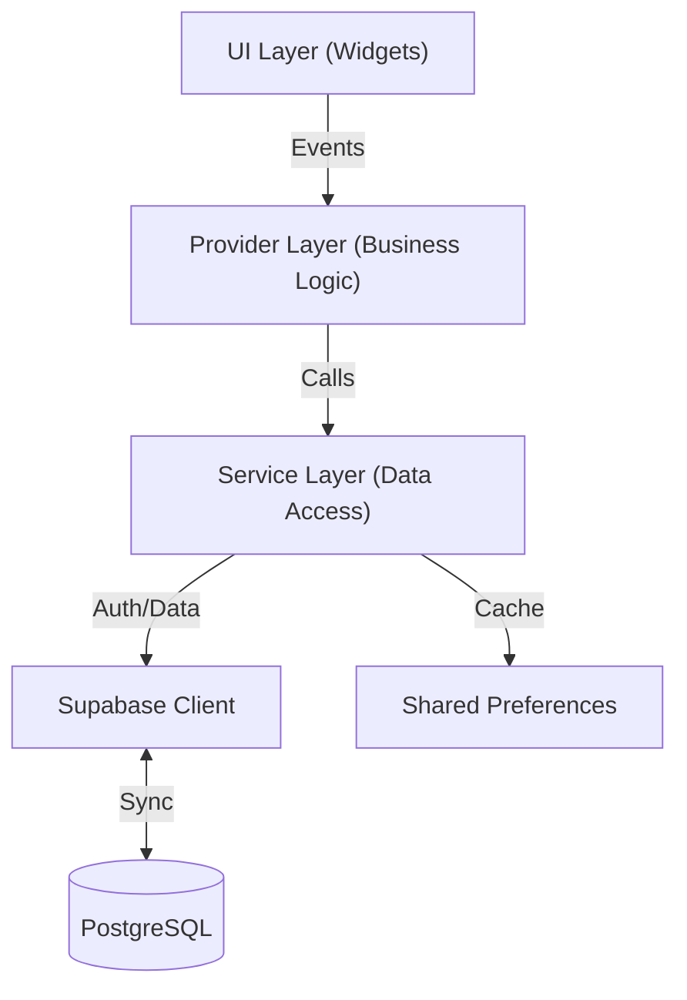

# Attend75

**Attend75** is a production-grade, cross-platform attendance tracking application built with **Flutter** and **Supabase**. It empowers students to maintain their attendance targets (e.g., 75%) through precise analytics, real-time synchronization, and intelligent "safe-to-skip" calculations.

This project demonstrates a robust **Server-First** architecture with seamless **Guest Mode** (local-first) capabilities, ensuring a smooth user experience whether online or offline.

## Overview

Attend75 solves the anxiety of attendance management by replacing manual calculations with data-driven insights. It functions as a single source of truth for student academic engagement, handling complex scenarios like duty leaves, medical absences, and multi-device synchronization.

The application leverages **Supabase** for backend services (Auth, Database, Realtime) while providing a high-performance, native feel via Flutter.

## Key Features

- **🎯 Smart Analytics System**:
  - **Status Indicators**: Visual cues for "Safe", "On Track", or "Critical".
  - **Predictive Insights**: Calculates exactly how many classes can be skipped or *must* be attended to reach the target.
- **👤 Hybrid Authentication Flow**:
  - **Guest Mode**: Fully functional local-first experience with no login required.
  - **Seamless Onboarding**: One-tap conversion from Guest data to a Cloud account.
  - **Social Auth**: Native Google & Apple Sign-In integration.
- **📅 Duty Leave Management**:
  - Distinguishes between "Physical Presence" and "Official Attendance".
  - One-tap status updates for excused absences.
- **🔄 Real-time Synchronization**: Instant data propagation across all user devices via Supabase Realtime.
- **🎨 Modern UI/UX**:
  - Fully adaptive Dark/Light/System themes.
  - **Shadcn UI** inspired components for a clean, professional aesthetic.
  - Smooth, physics-based page transitions and micro-interactions.

## Tech Stack

- **Framework**: [Flutter](https://flutter.dev) (Dart 3.x) — SDK `^3.10.1`
- **Backend as a Service**: [Supabase](https://supabase.com)
  - **Database**: PostgreSQL with Row Level Security (RLS)
  - **Auth**: JWT-based secure authentication
- **State Management**: [Provider](https://pub.dev/packages/provider) v6
- **Local Storage**: `shared_preferences` (Guest data & Settings persistence)
- **UI Components**: `shadcn_ui`, `lucide_icons`, `google_fonts`
- **Utilities**:
  - `flutter_local_notifications`: System-level alerts
  - `percent_indicator`: Visual data representation
  - `table_calendar`: Calendar-based attendance history
  - `intl`: Date/Time formatting & localization

## Architecture

The project follows a clean, layered architecture emphasizing separation of concerns and testability.



### Layer Breakdown
1.  **UI Layer (`/pages`, `/widgets`)**: Pure presentation components. Reactive to Provider state. No business logic.
2.  **Provider Layer (`/providers`)**:
    -   `AuthProvider`: Manages user session, Guest vs. Authenticated states, and profile recovery.
    -   `AttendanceProvider`: Aggregates usage data, computes statistics, and synchronizes local/remote state.
    -   `SettingsProvider`: Handles app-wide configuration (Theme, Notifications).
3.  **Service Layer (`/services`)**:
    -   Encapsulates external API calls (Supabase) and local storage IO.
    -   Handles error parsing, data transformation, and "fail-loudly" error reporting.

## Screenshots

### Authentication
| Sign In | Sign Up |
|:---:|:---:|
|  |  |

### Dashboard & Home
| Home | Dashboard (Light) | Dashboard (Dark) |
|:---:|:---:|:---:|
|  | .jpeg) | .jpeg) |

### Key Features
| Subjects | Duty Leave | Settings |
|:---:|:---:|:---:|
|  |  |  |

## Installation

### Prerequisites
- Flutter SDK 3.10 or higher
- Supabase Account

### Setup
1.  **Clone the repository**:
    ```bash
    git clone https://github.com/yourusername/attend75.git
    cd attend75
    ```

2.  **Install dependencies**:
    ```bash
    flutter pub get
    ```

3.  **Configure Supabase**:
    Create `lib/config/supabase_config.dart` (if not present) and add your keys:
    ```dart
    class SupabaseConfig {
      static const String supabaseUrl = 'YOUR_SUPABASE_URL';
      static const String supabaseAnonKey = 'YOUR_SUPABASE_ANON_KEY';
    }
    ```

4.  **Run the app**:
    ```bash
    flutter run
    ```

## Project Structure

```text
lib/
├── assets/              # App icons & screenshots
├── config/              # Supabase config & secrets
├── main.dart            # Entry point & app bootstrap
├── models.dart          # Data models (Subject, AttendanceLog, etc.)
├── pages/               # Full-screen route widgets
│   ├── auth/            # Login, Signup, Forgot Password flows
│   ├── settings/        # Notification & appearance settings
│   ├── dashboard_page   # Analytics dashboard
│   ├── home_page        # Daily attendance view
│   ├── duty_leave_page  # Duty leave management
│   ├── profile_page     # User profile
│   └── manage_subjects  # Subject CRUD
├── providers/           # ChangeNotifier state management
│   ├── attendance_provider  # Attendance logic & sync
│   ├── auth_provider        # Auth session & guest mode
│   ├── settings_provider    # App-wide settings
│   └── theme_provider       # Dark/Light/System themes
├── services/            # Data access & external APIs
│   ├── attendance_service   # Attendance CRUD
│   ├── auth_service         # Supabase Auth
│   ├── notification_service # Local notifications
│   ├── profile_service      # User profile management
│   └── ...                  # Subjects, Permissions, etc.
├── theme/               # Theme definitions
├── utils/               # Helpers (animations, calculations, responsiveness)
└── widgets/             # Reusable UI components
    ├── auth/            # Auth-specific widgets
    ├── subject_card     # Subject attendance cards
    ├── attendance_ring  # Circular progress indicators
    └── ...              # Buttons, modals, layout helpers
```

## State Management

The application uses **Provider** for dependency injection and state management due to its simplicity and effectiveness for this scale.

-   **Hydration Strategy**:
    -   **Authenticated**: On login, `AuthProvider` immediately fetches the user profile. `AttendanceProvider` performs a full sync with `attendance_logs` and `subjects` tables.
    -   **Guest**: Data is loaded lazily from `SharedPreferences`.
-   **Optimistic UI**: The app updates the local UI state immediately for interactions check-ins, reverting only if the server write fails ("Optimistic Locking" approach).

## Platform Support

| Platform | Support | Status |
|:---:|:---:|:---:|
| **Android** | ✅ | First-class citizen |
| **iOS** | ✅ | Fully supported |
| **macOS** | ✅ | Desktop-ready |

## Performance and Optimizations

-   **Lazy Loading**: Profile and heavy data sets are fetched only when required or post-login.
-   **Render Optimization**: Extensive use of `const` constructors and `Consumer` widgets to minimize rebuilds.
-   **Transition Efficiency**: Custom `AnimatedSwitcher` implementations for smooth navigation without jank.
-   **Asset Management**: SVG icons (Lucide) used over raster images for scalability and lower bundle size.

## Testing

*Currently, the project relies on manual regression testing.*

**Recommended Test Plan**:
1.  **Unit**: Test `AttendanceProvider` logic (percentage calculations).
2.  **Widget**: Verify login screen validation.
3.  **Integration**: Test end-to-end "Guest to Signed-in User" migration flow.

## Known Limitations

-   **Offline Sync (Auth Users)**: Authenticated users currently require an internet connection for write operations. Robust offline-queueing is in the roadmap.
-   **Complex Schedules**: Bi-weekly or rotating schedules are not yet natively supported (assumes weekly repetition).

## Future Improvements

-   [ ] **Offline Queue**: Implement Hive/Isar for full offline-first capabilities for logged-in users.
-   [ ] **University Import**: Import timetables directly from university portals.
-   [ ] **Class Notifications**: Geolocation-based reminders to mark attendance when entering campus.


## Author

Developed by **Naman Kumar**.
Connect on [GitHub](https://github.com/naman-kumar1212).

## License

This project is licensed under the **MIT License**.
